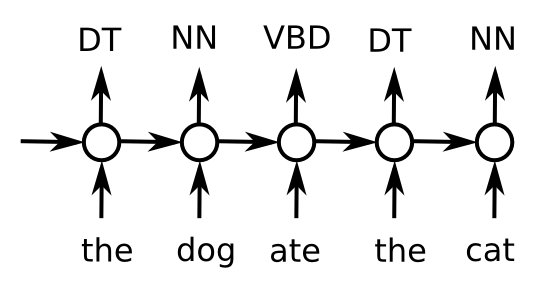

Part of Speech Tagging
----------------------

Convert a sequence of words into a sequence of part-of-speech tags.

We'll use the following reduced tag set for simplicity:

POS-tags
^^^^^^^^

* ADJ - adjective (new, good, high, ...)
* ADP - adposition (on, of, at, ...)
* ADV - adverb (really, already, still, ...)
* CONJ - conjunction (and, or, but, ...)
* DET - determiner, article (the, a, some, ...)
* NOUN - noun (year, home, costs, ...)
* NUM - numeral (twenty-four, fourth, 1991, ...)
* PRT - particle (at, on, out, ...)
* PRON - pronoun (he, their, her, ...)
* VERB - verb (is, say, told, ...)
* . - punctuation marks (. , ;)
* X - other (ersatz, esprit, dunno, ...)

An adposition is a cover term for prepositions and postpositions. It is a member of
a closed set of items that: occur before or after a complement composed of a noun phrase,
noun, pronoun, or clause that functions as a noun phrase, and.

Tips on how to improve training
^^^^^^^^^^^^^^^^^^^^^^^^^^^^^^^

* Go beyond SimpleRNN
    * Try `keras.layers.LSTM` and `keras.layers.GRU`
    * If you want to use a custom recurrent Cell, read this_
    * You can also try 1D Convolutions (`keras.layers.Conv1D`). They are often as good
      as recurrent layers but with less overfitting.
* Stack more layers
    * You can just add recurrent and 1D conv layers on top of one another and Keras
      will understand it.
    * Just remember that bigger networks may need more epochs to train.
* Gradient clipping
    * If your training isn't as stable as you'd like, set `clipnorm` in your optimizer.
    * Which is to say, it's a good idea to watch over your loss curve at each minibatch.
      Try a TensorBoard callback or something similar.
* Regularization
    * You can apply dropout as usual but also in an RNN-specific way.
    * `keras.layers.Dropout` works in between RNN layers.
    * Recurrent layers also have a `recurrent_dropout` parameter.
* More words
    * You can obtain greater performance by expanding your model's input dictionary.
    * Just make sure your model doesn't start to overfit due to additional parameters.
    * Combined with regularizers or pre-trained word-vectors, this would be good,
      because currently our model is blind to more than 5% of words.
* Make changes incrementally
    * Evolve the architecture in small iterations and record results of experiments
      to guide further research.
* Use pre-trained embeddings
    * You can use pre-trained weights from here_ to kickstart your embedding layer.
    * The embedding layer has a matrix W (layer.W), which contains word embeddings
      for each word in the dictionary. You can just overwrite them with `tf.assign`.
    * When using pre-trained embeddings, pay attention to the fact that the model's
      dictionary is different from your own.
    * You may want to switch `trainable=False` for your embedding layer in the first
      few epochs.
* More efficient batching
    * In the current implementation, TensorFlow spends a lot of time iterating over '0's.
    * This happens because each batch is padded to the length of the longest sentence.
    * You can speed things up by pre-generating batches of similar lengths and feeding it
      with a randomly chosen pre-generated batch.
    * This technically breaks the i.i.d. assumption, but it works unless you come up with
      some insane RNN architectures.
* Structured loss functions
    * Since we're tagging the whole sequence at once, we might as well train our network
      to do so.
    * There's more than one way to do so, but starting with `Conditional Random Fields`_
      is recommended.
    * You could plugin CRF as a loss function and still train by backprop. There's even
      a `TensorFlow implementation`_.

.. _this: https://keras.io/layers/recurrent/#rnn
.. _here: http://ahogrammer.com/2017/01/20/the-list-of-pretrained-word-embeddings/
.. _`Conditional Random Fields`: http://blog.echen.me/2012/01/03/introduction-to-conditional-random-fields/
.. _`TensorFlow implementation`: https://www.tensorflow.org/api_guides/python/contrib.crf
