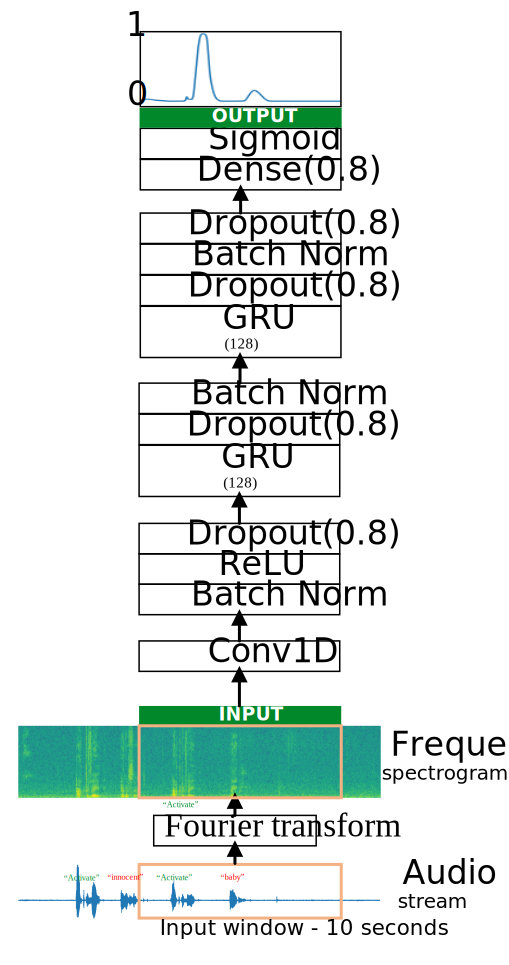

Wake-word Detection
-------------------

.. image:: ../../../images/sound.png

Implements a model for wake-word detection.

A speech dataset should ideally be as close as possible to the application you will want
to run it on. In this case, you'd like to detect the wake-word in working environments
(library, home, offices, open-spaces ...). You thus need to create recordings with a mix
of positive words (wake-word) and negative words (random words other than activate) on
different background sounds.

From audio recordings to spectrograms

What really is an audio recording? A microphone records little variations in air pressure
over time, and it is these little variations in air pressure that your ear also perceives
as sound. You can think of an audio recording as a long list of numbers measuring the
little air pressure changes detected by the microphone. We will use audio sampled at 44100 Hz
(or 44100 Hertz). This means the microphone gives us 44100 numbers per second. Thus, a
10 second audio clip is represented by 441000 numbers (= 10×44100).

It is quite difficult to figure out from this "raw" representation of audio whether a
wake-word was said. In order to help our sequence model more easily learn to detect wake-
words, we compute a spectrogram of the audio. The spectrogram tells us how much different
frequencies are present in an audio clip at a moment in time.

(If you've ever taken an advanced class on signal processing or on Fourier transforms, a
spectrogram is computed by sliding a window over the raw audio signal, and calculates the
most active frequencies in each window using a Fourier transform.)

The following chart is a spectrogram of an audio recording, where the color shows the degree
to which different frequencies are present (loud) in the audio at different points in time.
Green squares means a certain frequency is more active or more present in the audio clip
(louder); blue squares denote less active frequencies.

.. image:: ../../../images/spectrogram.png

The dimension of the output spectrogram depends upon the hyperparameters of the spectrogram
software and the length of the input. We will be working with 10 second audio clips as the
"standard length" for our training examples. The number of timesteps of the spectrogram will
be 5511. You'll see later that the spectrogram will be the input x into the network, and so
Tx=5511.

Note that even with 10 seconds being our default training example length, 10 seconds of time
can be discretized to different numbers of value. You've seen 441000 (raw audio) and 5511
(spectrogram). In the former case, each step represents 10/441000≈0.000023 seconds. In the
second case, each step represents 10/5511≈0.0018 seconds.

For the 10sec of audio, the key values you will see are:

* 441000 (raw audio)
* 5511=Tx (spectrogram output, and dimension of input to the neural network).
* 10000 (used by the pydub module to synthesize audio)
* 1375=Ty (the number of steps in the output of the GRU).

Note that each of these representations correspond to exactly 10 seconds of time. It's just
that they are discretized to different degrees. All of these are hyperparameters and can be
changed (except the 441000, which is a function of the microphone). We have chosen values that
are within the standard ranges used for speech systems.

Consider the Ty=1375 number above. This means that for the output of the model, we discretize
the 10s into 1375 time-intervals (each one of length 10/1375≈0.0072s) and try to predict for
each of these intervals whether someone recently finished saying the wake-word.

Consider also the 10,000 number above. This corresponds to discretizing the 10sec clip into
10/10000 = 0.001 second intervals. 0.001 seconds is also called 1 millisecond, or 1ms. So when
we say we are discretizing according to 1ms intervals, it means we are using 10,000 steps.

Generating a single training example

Because speech data is hard to acquire and label, we will synthesize our training data using
the audio clips of activates, negatives, and backgrounds. It is quite slow to record lots of
10 second audio clips with random wake-words in it. Instead, it is easier to record lots of
positives and negative words, and record background noise separately (or download background
noise from free online sources).

To synthesize a single training example, we will:

* Pick a random 10 second background audio clip
* Randomly insert 0-4 audio clips of the wake-word into this 10sec clip
* Randomly insert 0-2 audio clips of negative words into this 10sec clip
* Because we have synthesized the wake-word into the background clip, we know exactly when in
  the 10sec clip the wake-word makes its appearance. We'll see later that this makes it easier
  to generate the labels y⟨t⟩ as well.

We will use the pydub package to manipulate audio. Pydub converts raw audio files into lists
of Pydub data structures. Pydub uses 1ms as the discretization interval (1ms is 1 millisecond
= 1/1000 seconds), which is why a 10sec clip is always represented using 10,000 steps.

Overlaying positive/negative words onto the background clip:

Given a 10sec background clip and a short audio clip (positive or negative word), we need to be
able to "add" or "insert" the word's short audio clip onto the background. To ensure audio
segments inserted onto the background do not overlap, we will keep track of the times of
previously inserted audio clips. We will be inserting multiple clips of positive/negative words
onto the background, and we don't want to insert a wake-word or random word somewhere that
overlaps with another clip we have previously added.

For clarity, when we add a 1sec wake-word onto a 10sec clip of say cafe noise, we end up with
a 10sec clip that sounds like someone saying the wake-word in a cafe, with the wake-word
superimposed over the background cafe noise. We do not end up with an 11 sec clip.

Creating labels at the same time we overlay:

Recall also that the labels y⟨t⟩ represent whether or not someone has just finished saying the
wake-word. Given a background clip, we can initialize y⟨t⟩=0 for all t, since the clip doesn't
yet contain any wake-words.

When we insert or overlay a wake-word clip, we will also update labels for y⟨t⟩, so that 50
steps of the output now have target label 1. We will train a GRU to detect when someone has
finished saying the wake-word. For example, suppose the synthesized wake-word clip ends at
the 5sec mark in the 10sec audio - exactly halfway into the clip. Recall that Ty=1375, so
timestep 687 = int(1375*0.5) corresponds to the moment at 5sec into the audio. So, we will
set y⟨688⟩=1. Further, we would quite satisfied if the GRU detects the wake-word anywhere
within a short time-internal after this moment, so we actually set 50 consecutive values of
the label y⟨t⟩ to equal 1. Specifically, we have y⟨688⟩ = y⟨689⟩ = ⋯ = y⟨737⟩ = 1.

This is another reason for synthesizing the training data: It's relatively straightforward to
generate these labels y⟨t⟩ as described above. In contrast, if we have 10sec of audio recorded
on a microphone, it's quite time consuming for a person to listen to it and manually tag
exactly when the wake-word finished.

Here's a figure illustrating the labels y⟨t⟩ for a clip in which we have inserted "activate",
"innocent", activate", "baby." Note that the positive labels "1" are associated only with the
wake-words, in this case - "activate".

.. image:: ../../../images/label_diagram.png

To implement the training-set synthesis process, we will use the following helper functions.
All of these functions will use a 1ms discretization interval, so the 10sec of audio is always
discretized into 10,000 steps.

1. `get_random_time_segment(segment_ms)` gets a random time segment from our background audio
2. `is_overlapping(segment_time, existing_segments)` checks if a time segment overlaps with
   existing segments
3. `insert_audio_clip(background, audio_clip, existing_times)` inserts an audio segment at a
   random time in our background audio using `get_random_time_segment` and `is_overlapping`
4. `insert_ones(y, segment_end_ms)` inserts 1's into our label vector y after the wake-word
   is detected

Next, suppose we have inserted audio clips at segments (1000,1800) and (3400,4500), i.e., the
first segment starts at step 1000, and ends at step 1800. Now, if we are considering inserting
a new audio clip at (3000,3600) does this overlap with one of the previously inserted segments?
In this case, (3000,3600) and (3400,4500) overlap, so we should decide against inserting a clip
here.

For the purpose of this function, define (100,200) and (200,250) to be overlapping, since they
overlap at timestep 200. However, (100,199) and (200,250) are non-overlapping.

Development set

To test our model, we recorded a development set of 25 examples. While our training data is
synthesized, we want to create a development set using the same distribution as the real
inputs. Thus, we recorded 25 10-second audio clips of people saying the wake-word and other
random words, and labeled them by hand. This follows the principle that we should create the
dev set to be as similar as possible to the test set distribution; that's why our dev set uses
real rather than synthesized audio.

Network Architecture

The model will use 1-D convolutional layers, GRU layers, and dense layers.

.. image:: ../../../images/wake_word_model.png

One key step of this model is the 1D convolutional step (near the bottom of the diagram).
It inputs the 5,511 step spectrogram, and outputs a 1,375 step output, which is then further
processed by multiple layers to get the final Ty=1375 step output. This layer plays a role of
extracting low-level features and then possibly generating an output of a smaller dimension.
Computationally, the 1-D conv layer also helps speed up the model because now the GRU has to
process only 1375 timesteps rather than 5511 timesteps. The two GRU layers read the sequence
of inputs from left to right, then ultimately uses a dense+sigmoid layer to make a prediction
for y⟨t⟩. Because y is binary valued (0 or 1), we use a sigmoid output at the last layer to
estimate the chance of the output being 1, corresponding to the user having just said the
wake-word.

Note that we use a uni-directional RNN rather than a bi-directional RNN. This is really
important for wake-word detection, since we want to be able to detect the wake-word almost
immediately after it is said. If we used a bi-directional RNN, we would have to wait for the
whole 10sec of audio to be recorded before we could tell if the wake-word was said in the
first second of the audio clip.
