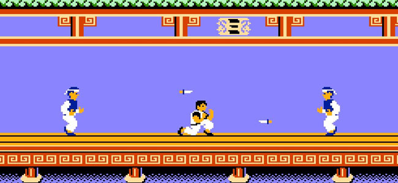

Kung-Fu Master with Advantage Actor-Critic
------------------------------------------

Implement a deep reinforcement learning agent for the Atari Kung-Fu Master Game
and train it with Advantage Actor-Critic (AAC).

The agent is a convolutional neural network that converts states into action
probabilities π and state values V.

Pre-processing
^^^^^^^^^^^^^^

* Image resized to 42x42 and converted to grayscale to run faster
* Rewards divided by 100 'cuz they are all divisible by 100
* Agent sees last 4 frames of game to account for object velocity
