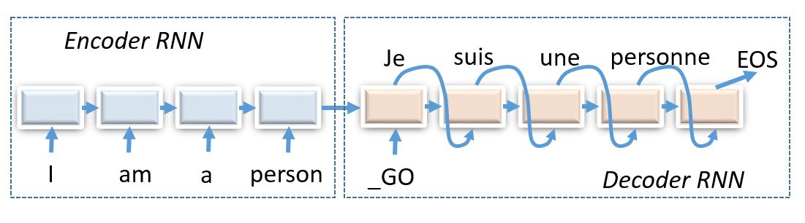

Reinforcement Learning for Seq2Seq
----------------------------------

Transcribe Hebrew words to English, which involves translating graphemes to phonemes.

    word (sequence of letters in source language) -> translation (sequence of letters in target language)

We'll attempt to train to maximize likelihood of correct translation, and also employ reinforcement
learning to teach it to translate with as few errors as possible.

One notable property of Hebrew is that it's a consonant language. That is, there are no vowels in
the written language. One could represent vowels with diacritics above consonants, but you don't
expect people to do that in everyday life.

Therefore, some Hebrew characters will correspond to several english letters and others to none,
so we can use an encoder-decoder architecture to figure that out.

Encoder-decoder architectures are about converting anything to anything, including:

* Machine translation and spoken dialogue systems
* `Image captioning <http://cocodataset.org/#captions-2015>`_ and
  `image2latex <https://openai.com/requests-for-research/#im2latex>`_ (convolutional encoder, recurrent decoder)
* Generating `images by captions <https://arxiv.org/abs/1511.02793>`_ (recurrent encoder, convolutional decoder)
* Grapheme -> phoneme - convert words to transcripts

A simplified Hebrew -> English machine translation for words and short phrases (character-level)
was chosen as it is relatively quick to train even without a GPU cluster.

Variations
^^^^^^^^^^

Try easy_mode=False, start with the following architecture:

::
    encoder---decoder
               P(y|h)
                 ^
      LSTM ->   LSTM
       ^         ^
      LSTM ->   LSTM
       ^         ^
     input     y_prev

Note: you can fit all 4 state tensors of both LSTMs into a in a single state. Just assume that
it contains, for example, h0, c0, h1, c1 - pack it in encode and update in decode.

Other ideas:

* In some TensorFlow versions and for some layers, it is required that each RNN/GRU/LSTM cell
  gets it's own tf.variable_scope(unique_name, reuse=False). Otherwise it will complain about
  wrong tensor sizes, because it tries to reuse weights from one RNN to the other.
* You will likely need to adjust pre-training time for such a network.
* Supervised pre-training may benefit from clipping gradients somehow.
* SCST may indulge a higher learning rate in some cases and changing entropy regularizer over time.
* It's often useful to save pre-trained model parameters to not re-train it every time you want
  new policy gradient parameters.
* When leaving training to run overnight, try setting REPORT_FREQ to a larger value (e.g. 500) to
  not to waste time on it.
* (advanced deep learning) It may be a good idea to first train on small phrases and then adapt
  to larger ones (a.k.a. training curriculum).
* (advanced nlp) You may want to switch from raw utf8 to something like unicode or even syllables
  to make the task easier.
* (advanced nlp) Since hebrew words are written with vowels omitted, you may want to use a small
  Hebrew vowel markup dataset at he-pron-wiktionary.txt.

Attention

There's more than one way to connect decoder to encoder:

* Vanilla: layer_i of encoder last state goes to layer_i of decoder initial state
* Every tick: feed encoder last state on every iteration of decoder
* Attention: allow decoder to "peek" at one (or several) positions of encoded sequence on every tick

The most effective of these is attention. You can read more about attention in this
`blog post <https://distill.pub/2016/augmented-rnns/>`_. The easiest way to begin is to use "soft"
attention with "additive" or "dot-product" intermediate layers.

Tips

* The model usually generalizes better if you no longer allow decoder to see final encoder state
* Once your model makes it through several epochs, it is a good idea to visualize attention maps
  to understand what your model has actually learned
* If you opt for hard attention, we recommend Gumbel-softmax instead of sampling

UREX - Under-appreciated Reward Exploration by Google Brain

* This is a way to improve exploration in policy-based settings. The main idea is that you find
  and upweight under-appreciated actions. See this
  `video <https://www.youtube.com/watch?v=fZNyHoXgV7M&feature=youtu.be&t=3444>`_ and
  `article <https://arxiv.org/abs/1611.09321>`_.
* Also see `this article <https://www.linkedin.com/pulse/urex-under-appreciated-reward-exploration-google-brain-nikita-johnson/>`_.
* You may want to reduce batch size as UREX requires you to sample multiple times per source sentence.
* Once you got it working, try using 'experience replay' with 'importance sampling' instead of
  (or in addition to) basic UREX.
