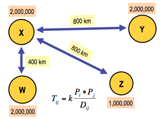
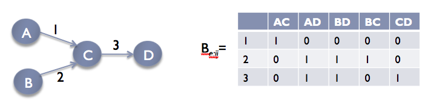
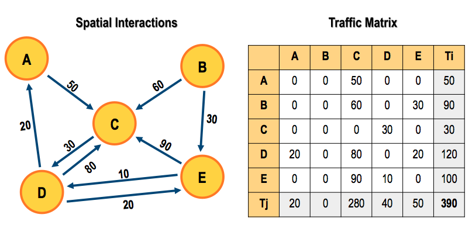

Minimizing network delay using Deep Deterministic Policy Gradients (DDPG)
-------------------------------------------------------------------------

A Deep-Reinforcement Learning agent that optimizes routing. Our agent adapts automatically
to current traffic conditions and proposes tailored configurations that attempt to minimize
the network delay. Experiments show very promising performance. Moreover, this approach
provides important operational advantages with respect to traditional optimization algorithms.

See `A Deep-Reinforcement Learning Approach for Software-Defined Networking Routing Optimization <https://arxiv.org/abs/1709.07080>`_.

Glossary
^^^^^^^^

DDPG - Deep Deterministic Policy Gradient. Google DeepMind devised a solid algorithm for
tackling the continuous action space problem. Building off their `prior work <http://proceedings.mlr.press/v32/silver14.pdf>`_
on Deterministic Policy Gradients, they produced a policy-gradient actor-critic algorithm called
`Deep Deterministic Policy Gradients (DDPG) <https://arxiv.org/pdf/1509.02971v2.pdf>`_ that is
off-policy and model-free, and that uses some of the deep learning tricks that were introduced
along with Deep Q-Networks (hence the "deep"-ness of DDPG).

See `Deep Deterministic Policy Gradients in TensorFlow <https://pemami4911.github.io/blog/2016/08/21/ddpg-rl.html>`_.

Policy Gradient Methods. Policy-Gradient (PG) algorithms optimize a policy end-to-end by
computing noisy estimates of the gradient of the expected reward of the policy and then
updating the policy in the gradient direction. Traditionally, PG methods have assumed a
stochastic policy μ(a|s), which gives a probability distribution over actions. Ideally,
the algorithm sees lots of training examples of high rewards from good actions and negative
rewards from bad actions. For RL problems with continuous action spaces, vanilla-PG is all
but useless due to the credit assignment problem.

Actor-Critic Algorithms.

.. image:: ../../../images/actor-critic.png

The Actor-Critic learning algorithm is used to represent the policy function independently
of the value function. The policy function structure is known as the actor, and the value
function structure is referred to as the critic. The actor produces an action given the
current state of the environment, and the critic produces a TD (Temporal-Difference) error
signal given the state and resultant reward. If the critic is estimating the action-value
function Q(s,a), it will also need the output of the actor. The output of the critic drives
learning in both the actor and the critic. In Deep Reinforcement Learning, neural networks
can be used to represent the actor and critic structures.

Off-Policy vs. On-Policy. Reinforcement Learning algorithms which are characterized as
off-policy generally employ a separate behavior policy that is independent of the policy
being improved upon; the behavior policy is used to simulate trajectories. A key benefit
of this separation is that the behavior policy can operate by sampling all actions, whereas
the estimation policy can be deterministic (e.g., greedy) [1]. Q-learning is an off-policy
algorithm, since it updates the Q values without making any assumptions about the actual
policy being followed. Rather, the Q-learning algorithm simply states that the Q-value
corresponding to state s(t) and action a(t) is updated using the Q-value of the next state
s(t+1) and the action a(t+1) that maximizes the Q-value at state s(t+1).

On-policy algorithms directly use the policy that is being estimated to sample trajectories
during training.

Model-free Algorithms. Model-free RL algorithms are those that make no effort to learn the
underlying dynamics that govern how an agent interacts with the environment. In the case
where the environment has a discrete state space and the agent has a discrete number of
actions to choose from, a model of the dynamics of the environment is the 1-step transition
matrix: T(s(t+1) | s(t), a(t)). This stochastic matrix gives all of the probabilities for
arriving at a desired state given the current state and action. Clearly, for problems with
high-dimensional state and action spaces, this matrix is incredibly expensive in space and
time to compute. If your state space is the set of all possible 64 x 64 RGB images and your
agent has 18 actions available to it, the transition matrix’s size is \|S × S × A\| ≈
\|(68.7 × 10^9) × (68.7 × 10^9) × 18\|, and at 32 bits per matrix element, that's around
3.4 × 10^14 GB to store it in RAM!

Rather than dealing with all of that, model-free algorithms directly estimate the optimal
policy or value function through algorithms such as policy iteration or value iteration.
This is much more computationally efficient. I should note that, if possible, obtaining and
using a good approximation of the underlying model of the environment can only be beneficial.
Be wary - using a bad approximation of a model of the environment will only bring you misery.
In addition, model-free methods generally require a larger number of training examples.

Target networks. Directly updating your actor and critic neural network weights with the
gradients obtained from the TD error signal that was computed from both your replay buffer
and the output of the actor and critic networks causes your learning algorithm to diverge
(or to not learn at all). It was recently discovered that using a set of target networks to
generate the targets for your TD error computation regularizes your learning algorithm and
increases stability.

Building
^^^^^^^^

1. Use a modern Linux or OSX system.
2. Install `OMNeT++ version 4.6 <https://omnetpp.org/>`_.
3. Run `make` from in `omnet/router`. This will generate `networkRL`, which is needed by the
   python script.
4. Use Python version 3.6.
5. Install the packages listed in `requirements.txt` into your virtual environment. (The code
   has been tested with the versions listed.)

Training
^^^^^^^^

Single run with parameters in `hyperparams.yml` or supplied as command line arguments:

    python rl/routing_optimization/__init__.py

Playing
^^^^^^^

Reads hyperparams from `<folder>` (created from training):

    python rl/routing_optimization/__init__.py --play --folder <folder>

Using traffic file:

    python rl/routing_optimization/__init__.py --play --folder <folder> --traffic-folder <path to folder with traffic file>

Gravity Model
^^^^^^^^^^^^^

Many networks serve as conduits – either literally or figuratively – for flows, in the sense
that they facilitate the movement of something, such as materials, people, or information.

In Newton’s law of gravitation the force is proportional to the product of the masses of the
two objects divided by the distance squared. Similarly, in gravity models for interactions
between cities, the relative strength of the interaction might be modeled as proportional to
the product of the cities’ populations. A general formulation of a gravity model is given by
Xij = Ri·Aj / fij, where Xij is the matrix element representing the force from i to j; Ri
represents the repulsive factors that are associated with leaving from i; Aj represents the
attractive factors that are associated with going to j; and fij is a friction factor from i to j.

For example, a transportation network can be represented as a graph G = (V,E). The nodes are
cities, the edges are roads connecting the cities. Traffic passes through links moving between
origin and destination vertices. Additional information about the nodes and the edges is the
population of the cities and the distances between them.

In network applications, gravity models have been used to model the volume of telephone calls
in a network. In the context of Internet TMs, we can naturally interpret Xij as the traffic
volume that enters the network at location i and exits at location j, the repulsion factor Ri
as the traffic volume entering the network at location i, and the attractivity factor Aj as
the traffic volume exiting at location j. The friction matrix (fij ) encodes the locality
information specific to different source-destination pairs, however, as locality is not as
large a factor in Internet traffic as in the transport of physical goods, we shall assume a
common constant for the friction factors. The resulting gravity model simply states that the
traffic exchanged between locations is proportional to the volumes entering and exiting at
those locations.

Routing matrix
^^^^^^^^^^^^^^

Captures the manner in which traffic moves throughout the network. It is defined to have the
same number of rows and columns as links and origin-destination pairs in G, respectively. In
the case that each origin- destination pair (i, j) has only a single route, from i to j, B is
a binary matrix, with the entry in the row corresponding to link e and the column corresponding
to pair (i, j). If multiple routes are possible, the entries of B are instead fractions
representing, for example, the proportion of traffic from i to j that is expected to use the
link e.

Traffic matrix
^^^^^^^^^^^^^^

Traffic matrix defines the volume of flow for each corresponding pair of vertices.

An IP network can be abstractly thought of as a graph, whose nodes are routers, and whose edges
are links between these. A Traffic Matrix (TM) describes the volumes of traffic traversing a
network from the point at which it enters the network, to the exit point.

SNMP data is easy to collect, and almost ubiquitous. However, SNMP data only provides link load
measurements, not TM measurements. The link measurements y are related to the TM, which is written
as a column vector x, by the relationship y = Ax where A is called the routing matrix.

See `Gravity Models <https://courses.cs.ut.ee/2011/graphmining/Main/GravityModels>`_ and
`Simplifying the synthesis of Internet traffic matrices
<http://www.maths.adelaide.edu.au/matthew.roughan/papers/ccr_2005.pdf>`_

Suggested Improvements
^^^^^^^^^^^^^^^^^^^^^^

1. Use a priority algorithm for sampling from the replay buffer instead of uniformly sampling.
   See summary of `Prioritized Experience Replay <https://pemami4911.github.io/paper-summaries/deep-rl/2016/01/26/prioritizing-experience-replay.html>`_.
2. Experiment with different stochastic policies to improve exploration.
3. Use recurrent networks to capture temporal nuances within the environment.
4. The authors of DDPG also used convolutional neural networks to tackle control tasks of
   higher complexities.
