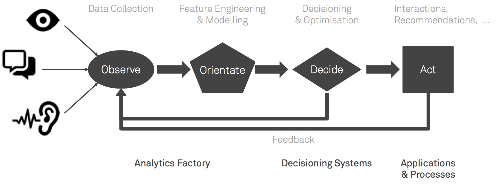

Survey of Methods
^^^^^^^^^^^^^^^^^

1. `Q-Table Learning Agent <q_table_learning/>`_
2. `Multi-armed Bandit <multi_armed_bandit/>`_ (TensorFlow)
3. `Contextual Bandits <contextual_bandits/>`_ (TensorFlow)
4. `Vanilla Policy Gradient Agent <policy_gradient/>`_ (TensorFlow)
5. `Model-based example for RL <model_based/>`_ (TensorFlow)
6. `Deep Q-Network <dqn/>`_ (TensorFlow)
7. `Deep Recurrent Q-Network <deep_recurrent_q_network/>`_ (TensorFlow)
8. `Asynchronous Actor-Critic Agents (A3C) <a3c/>`_ (TensorFlow)

Introduction
^^^^^^^^^^^^

Reinforcement Learning is a third type of machine learning:

1. Supervised Learning
2. Unsupervised Learning
3. Reinforcement Learning

Why the interest in RL? Using John Boyd's [OODA Loop](https://en.wikipedia.org/wiki/OODA_loop)
as an end-to-end process view of analytics, the Observe (data engineering) and Orient (analytics,
insights, data science) phases receive a lot of attention. Decide and Act is often through a
human agent (insight to dashboard to human perception to some assumed decision and action), or
automated through simple rules/policies of the if-then-else variety.

Reinforcement learning is the application of machine learning to policy to automate decisions
and actions taking into account feedback from the environment.

Another way of looking at RL is as the study of agents and how they learn by trial and error.
It formalizes the idea that rewarding or punishing an agent for its behaviour is more likely to
repeat or forgo that behaviour in the future.

Side note: RL is a form of operant conditioning (or instrumental conditioning) [Skinner, 1938],
versus classical conditioning whereby events that occur together positively reinforce each other
[Pavlov, 1927]. Both could be considered forms of Hebbian learning: development of formal models
of how the synaptic weights between neurons are reinforced by simultaneous activation - "Cells
that fire together, wire together." [Hebb, 1961]

Approach to Learning
^^^^^^^^^^^^^^^^^^^^

Model-free / Value function methods:

* Estimate value states (or state-action pairs)
* Policy based on selecting actions that lead to large value states

Model-based / Direct Policy Search

* Model the policy itself (state -> action)

  * Adjust model parameters in direction of greatest policy improvement

Action types:

* Discrete
* Continuous

Challenges:

1. Representation

   * Large state spaces
   * Large action spaces
   * Continuous action spaces

2. Generalization

   * Ability to act well in unseen states

3. Exploration vs Exploitation
4. Temporal Credit Assignment

   * Which of the actions was salient for the eventual observed outcome?

Regret
^^^^^^

The gap between optimal policy and selected actions.

Greedy and Epsilon-Greedy policies have linear regret L_T >= Const . T

No matter the algorithm, lower bound on regret is lim{T -> inf} L_T >= Const' . logT [Lai and Robbins]

Greedy exploits too much. Epsilon-Greedy explores too much.

Approach to Exploration
^^^^^^^^^^^^^^^^^^^^^^^

**Greedy**. A naive approach to ensuring the optimal action is taken at any given time
is to simply choose the action which the agent expects to provide the greatest reward.
Taking the action which the agent estimates to be the best at the current moment is
an example of exploitation: the agent is exploiting its current knowledge about the
reward structure of the environment to act.

The problem with a greedy approach is that it almost universally arrives at a
suboptimal solution.

::

    # Use this for action selection.
    # Q_out refers to activation from final layer of the Q-Network.
    Q_values = sess.run(Q_out, feed_dict={inputs: [state]})
    action = np.argmax(Q_values)

**Variation - Optimistic Greedy**. Initialize all actions to optimistic value, such as 1,
to ensure that all actions are tried at least once.

::

    Q_values = np.ones(n_actions)

**Optimistic-Greedy**. Initialize rewards per action to a large initial value. Force playing
untried actions.

**Random**. The opposite approach to greedy selection is to simply always take a random
action.

::

    # Assuming we are using OpenAI gym environment.
    action = env.action_space.sample()

    #Otherwise:
    action = np.random.randint(0, n_actions)

**ϵ-Greedy Approach**. In this approach the agent chooses what it believes to be the
optimal action most of the time, but occasionally acts randomly. The ϵ in ϵ-greedy
is an adjustable parameter which determines the probability of taking a random,
rather than principled, action. Due to its simplicity and surprising power, this
approach has become the defacto technique for most recent reinforcement learning
algorithms, including DQN and its variants.

At the start of the training process the e value is often initialized to a large
probability, to encourage exploration in the face of knowing little about the
environment. The value is then annealed down to a small constant (often 0.1), as
the agent is assumed to learn most of what it needs about the environment.

::

    epsilon = 0.1
    if np.random.rand(1) < epsilon:
        action = env.action_space.sample()
    else:
        Q_dist = sess.run(Q_out, feed_dict={inputs: [state]})
        action = np.argmax(Q_dist)

Variant - annealing of ϵ to some low value or zero.

**Upper Confidence Bound Algorithm (UCB)**. Optimism in the face of uncertainty.

UCB1 achieves logarithmic regret.

**Posterior Sampling Approaches (Thompson Sampling)**.

Posterior Sampling also achieves logarithmic regret bound.

**Boltzmann Approach**. Instead of always taking the optimal action, or taking a
random action, this approach involves choosing an action with weighted probabilities.
To accomplish this we use a softmax over the networks estimates of value for each
action. In this case the action which the agent estimates to be optimal is most
likely (but is not guaranteed) to be chosen. The biggest advantage over e-greedy
is that information about likely value of the other actions can also be taken into
consideration. If there are 4 actions available to an agent, in e-greedy the 3
actions estimated to be non-optimal are all considered equally, but in Boltzmann
exploration they are weighed by their relative value. This way the agent can ignore
actions which it estimates to be largely sub-optimal and give more attention to
potentially promising, but not necessarily ideal actions.

In practice we utilize an additional temperature parameter (τ) which is annealed
over time. This parameter controls the spread of the softmax distribution, such
that all actions are considered equally at the start of training, and actions are
sparsely distributed by the end of training.

::

    # Boltzmann softmax equation
    P_t(a) = exp(q_t(a) / τ) / sum{i=1 to n}(exp(q_t(i) / τ)

The underlying assumption made in Boltzmann exploration is that the softmax over
network outputs provides a measure of the agent’s confidence in each action. If
action 2 is 0.7 and action 1 is 0.2 the tempting interpretation is that the agent
believes that action 2 is 70% likely to be optimal, whereas action 1 is 20% likely
to be optimal. In reality this isn’t the case. Instead what the agent is estimating
is a measure of how optimal the agent thinks the action is, not how certain it is
about that optimality. While this measure can be a useful proxy, it is not exactly
what would best aid exploration. What we really want to understand is the agent’s
uncertainty about the value of different actions.

::

    # Add this to network to compute Boltzmann probabilities
    Temp = tf.placeholder(shape=None, dtype=tf.float32)
    Q_dist = slim.softmax(Q_out/Temp)

    # Use this for action selection.
    t = 0.5
    Q_probs = sess.run(Q_dist,feed_dict={inputs: [state], Temp: t})
    action_value = np.random.choice(Q_probs[0], p=Q_probs[0])
    action = np.argmax(Q_probs[0] == action_value)

**Bayesian Approaches (w/ Dropout)**. What if an agent could exploit its own uncertainty
about its actions? This is exactly the ability that a class of neural network models
referred to as Bayesian Neural Networks (BNNs) provide. Unlike traditional neural
network which act deterministically, BNNs act probabilistically. This means that
instead of having a single set of fixed weights, a BNN maintains a probability
distribution over possible weights. In a reinforcement learning setting, the
distribution over weight values allows us to obtain distributions over actions as
well. The variance of this distribution provides us an estimate of the agent’s
uncertainty about each action.

In practice however it is impractical to maintain a distribution over all weights.
Instead we can utilize dropout to simulate a probabilistic network. Dropout is a
technique where network activations are randomly set to zero during the training
process in order to act as a regularizer. By repeatedly sampling from a network
with dropout, we are able to obtain a measure of uncertainty for each action. When
taking a single sample from a network with Dropout, we are doing something that
approximates sampling from a BNN.

In order to get true uncertainty estimates, multiple samples are required, thus
increasing computational complexity. In my own experiments however I have found it
sufficient to sample only once, and use the noisy estimates provided by the network.
In order to reduce the noise in the estimate, the dropout keep probability is simply
annealed over time from 0.1 to 1.0.

::

    #Add to network
    keep_per = tf.placeholder(shape=None, dtype=tf.float32)
    hidden = slim.dropout(hidden, keep_per)

    keep_prob = 0.5
    Q_values = sess.run(Q_out, feed_dict={inputs: [state], keep_per: keep_prob})
    action = # Insert your favorite action-selection strategy with the sampled Q-values.

**Advanced Approaches**

All of the methods discussed above deal with the selection of actions. There is another
approach to exploration that deals with the nature of the reward signal itself. These
approaches fall under the umbrella of intrinsic motivation.

* Variational Information Maximizing Exploration
* Incentivizing Exploration In Reinforcement Learning With Deep Predictive Models
* Unifying Count-Based Exploration and Intrinsic Motivation
* Hierarchical Deep Reinforcement Learning: Integrating Temporal Abstraction and Intrinsic Motivation

Notes:

* Greedy and ϵ-Greedy have linear (sub-optimal) regret.
* Worst-case regret is logT (T - number of time steps).
* Regret Minimization Principle - "Optimism in the face of uncertainty"

  * Use collected data to eliminate arms that "very likely" are sub-optimal
  * Choose the most optimistic remaining option. (A more uncertain outcome could result
    in a higher reward!)
  * UCB1 algorithm achieves a logarithmic regret - play the action that has the highest
    upper confidence interval.