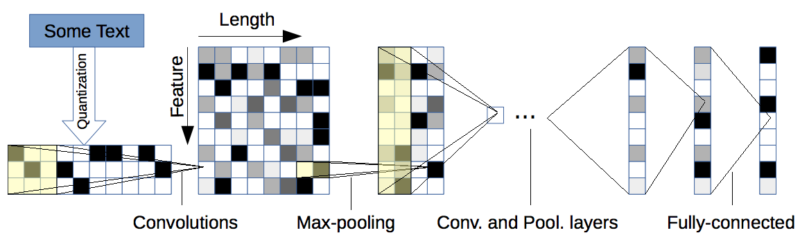

Character-level CNN
-------------------

Character-level ConvNet is an effective method for text classification without the need for words.
This is a strong indication that language could also be thought of as a signal no different from
any other kind. (`Character-level Convolutional Networks for Text Classification <https://arxiv.org/pdf/1509.01626.pdf>`_)

Historically, ConvNets usually require large-scale datasets to work.

When trained on large scale datasets, deep ConvNets do not require the knowledge of words, in
addition to the conclusion from previous research that ConvNets do not require the knowledge
about the syntactic or semantic structure of a language. This simplification of engineering
could be crucial for a single system that can work for different languages, since characters
always constitute a necessary construct regardless of whether segmentation into words is possible.
Working on only characters also has the advantage that abnormal character combinations such as
misspellings and emoticons may be naturally learnt.

Dataset size forms a dichotomy between traditional and ConvNets models. Traditional methods like
n-grams TFIDF remain strong candidates for dataset of size up to several hundreds of thousands,
and only until the dataset goes to the scale of several millions do we observe that character-level
ConvNets start to do better.

ConvNets may work well for user-generated data. Further analysis is needed to validate the
hypothesis that ConvNets are truly good at identifying exotic character combinations such as
misspellings and emoticons.

--model-filename=./models_bal/weights.best.hdf5
--data-dir=balanced