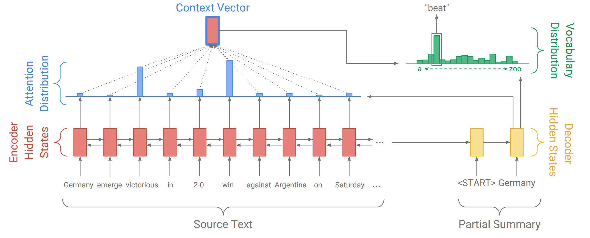
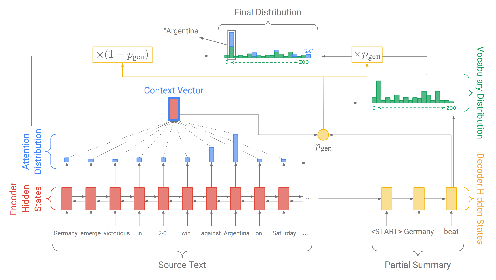

Pointer Generator Network for Text Summarization
------------------------------------------------

The sequence-to-sequence model with attention, illustrated below, has become popular for summarization.

The pointer-generator network is a hybrid network that can choose to copy words from the source via pointing,
while retaining the ability to generate words from the fixed vocabulary.

As before, we calculate an attention distribution and a vocabulary distribution. However, we also calculate
the generation probability p_​gen, which is a scalar value between 0 and 1. This represents the probability
of generating a word from the vocabulary, versus copying a word from the source. The generation probability
p_gen is used to weight and combine the vocabulary distribution P_vocab (which we use for generating) and
the attention distribution aa (which we use for pointing to source words w_i) into the final distribution
P_final via the following formula:

        P_final(w) = p_gen P_vocab(w) + (1 - p_gen) ​∑{i:w_i = w}a_i

This formula just says that the probability of producing word w is equal to the probability of generating it
from the vocabulary (multiplied by the generation probability) plus the probability of pointing to it anywhere
it appears in the source text (multiplied by the copying probability).

See `Taming Recurrent Neural Networks for Better Summarization <http://www.abigailsee.com/2017/04/16/taming-rnns-for-better-summarization.html>`_.

Help, I've got NaNs!
^^^^^^^^^^^^^^^^^^^^

For reasons that are `difficult to diagnose <https://github.com/abisee/pointer-generator/issues/4>`_,
NaNs sometimes occur during training, making the loss=NaN and sometimes also corrupting the model checkpoint
with NaN values, making it unusable. Here are some suggestions:

1. If training stopped with the Loss is not finite. Stopping. exception, you can just try restarting. It may
   be that the checkpoint is not corrupted.
2. You can check if your checkpoint is corrupted by using the inspect_checkpoint.py script. If it says that
   all values are finite, then your checkpoint is OK and you can try resuming training with it.
3. The training job is set to keep 3 checkpoints at any one time (see the max_to_keep variable in
   run_summarization.py). If your newer checkpoint is corrupted, it may be that one of the older ones is not.
   You can switch to that checkpoint by editing the checkpoint file inside the train directory.
4. Alternatively, you can restore a "best model" from the eval directory.
5. If you want to try to diagnose the cause of the NaNs, you can run with the --debug=1 flag turned on.
   This will run `Tensorflow Debugger <https://www.tensorflow.org/guide/debugger>`_, which checks for NaNs and
   diagnoses their causes during training.